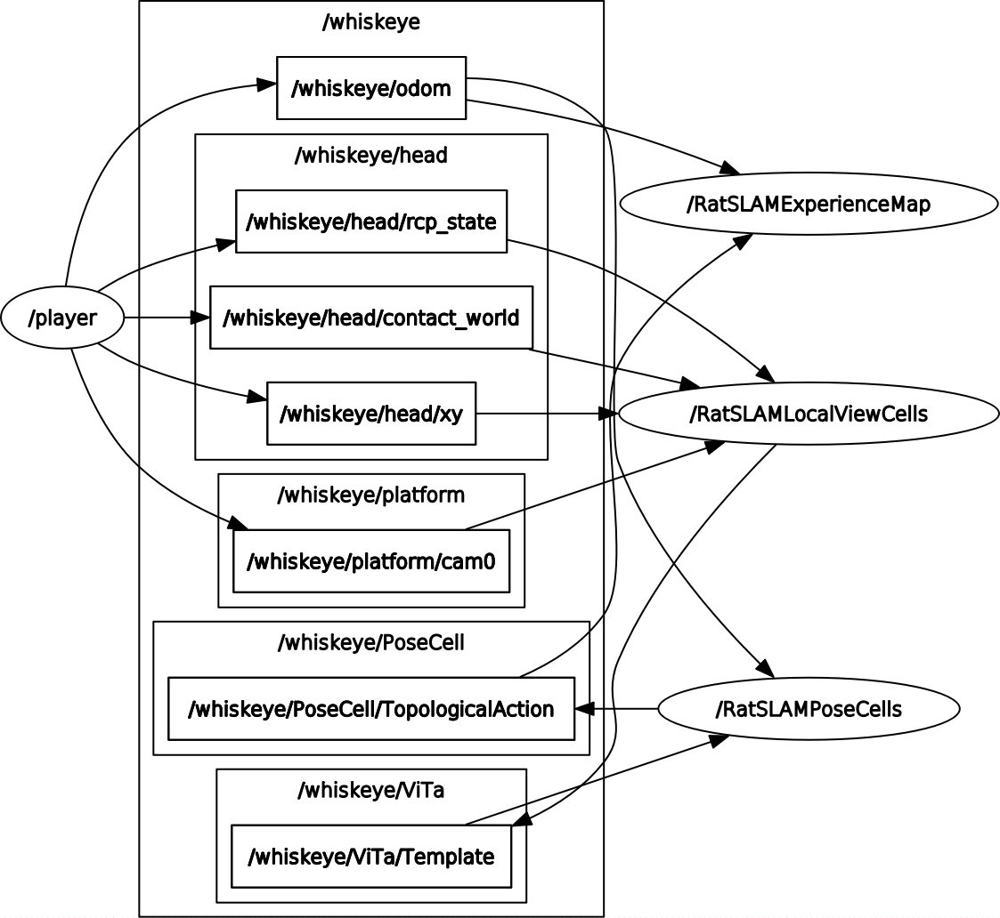
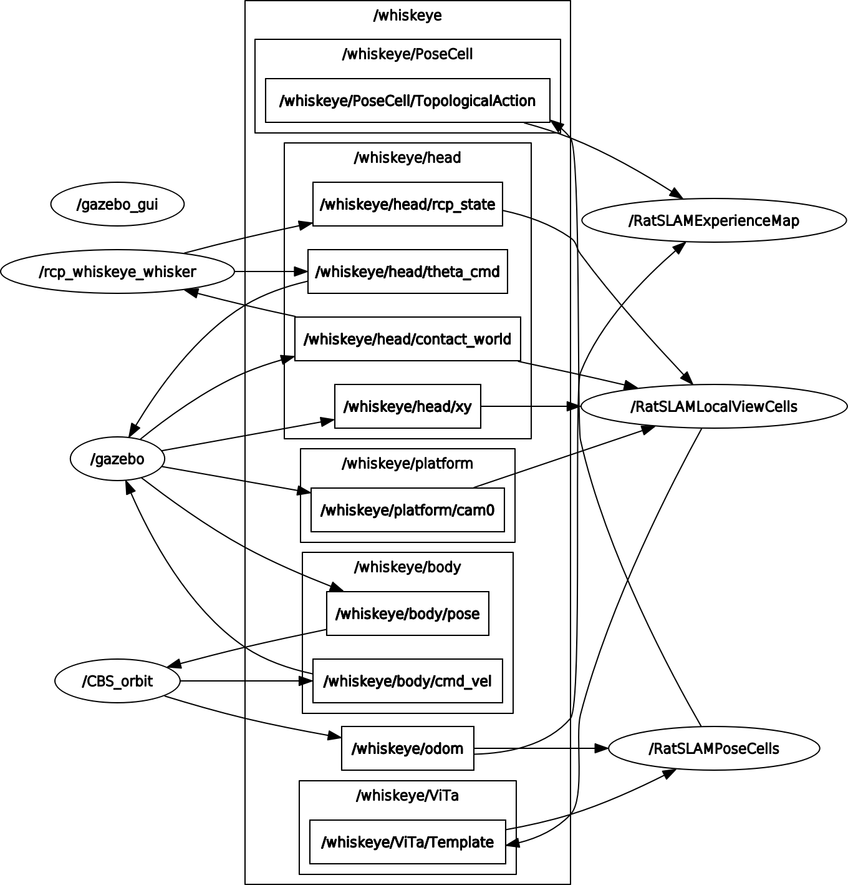

# Master Node Documentation

This project contains the documentaiton for Master Node.

## Installation

1. Install ROS
Tested with Ubuntu 18.04 and ROS melodic. (For more details visit http://wiki.ros.org/melodic/Installation/Ubuntu)

`sudo apt update && sudo apt upgrade`

`sudo sh -c 'echo "deb http://packages.ros.org/ros/ubuntu $(lsb_release -sc) main" > /etc/apt/sources.list.d/ros-latest.list'`

`sudo apt-key adv --keyserver 'hkp://keyserver.ubuntu.com:80' --recv-key C1CF6E31E6BADE8868B172B4F42ED6FBAB17C654`

`sudo apt update`

`sudo apt install ros-melodic-desktop-full`

Set up rosdep:
`sudo rosdep init`

`rosdep update`

Set up the environment:
`echo "source /opt/ros/melodic/setup.bash" >> ~/.bashrc`

`source ~/.bashrc`

Set up the workspace:
Create folder:

`mkdir -p [dir of your choice]/whiskeye\_ws/src`

`cd whiskeye\_ws`

`catkin\_make`

2. Download the code base 
Check out this repository in the src of your catkin workspace. It contains all packages

Sanity check: Make sure the following packages are in catkin\_ws/src/:
- master_node
- whiskeye_gazebo
- vita-slam
- whiskeye_controller

3. Run catkin\_make in whiskeye\_ws/

4. Fix possible compile errors ....

4.1 Irrlicht
Irrlicht is a 3D rendering library used to render the posecell network and the experience map.
It needs to be installed using
`sudo apt install libirrlicht-dev`
Otherwise you will get errors like: "undefined reference to `irr::video::IdentityMaterial'"

4.2 Permission denied
ROS is not able to create log files and access other ros related files:
`rosdep fix-permissions`

5. Testing
Adjust the config file in whiskeye_ws/src/vita-slam/config_whiskeye.txt.in:
- Update media path depending on your machine

5.1 Testing vitaslam with our rosbags
Download the rosbags from:
- https://aaltofi-my.sharepoint.com/:f:/g/personal/oliver_struckmeier_aalto_fi/Eo5QWmnFoqpKpH-5Rs5BLEsBHkuCW81LPBeS68JeMQNp4A?e=tTxh2g

Start the playback of any rosbag (for testing) with:
`roslaunch master_node bagfile.launch bagfile_path:="path/to/your/bagfile.bag"`

You should see the experience map, posecell network and view cells window.

5.2 Testing with gazebo
To run vitaslam in combination with gazebo instead of the use:
`roslaunch master_node master.launch`
You should see the same windows plus gazebo opening.

## Description
The Node Graph when running ViTa-SLAM with a bagfile looks like follows:

The Node Graph when running ViTa-SLAM with gazebo looks like follows:

 
